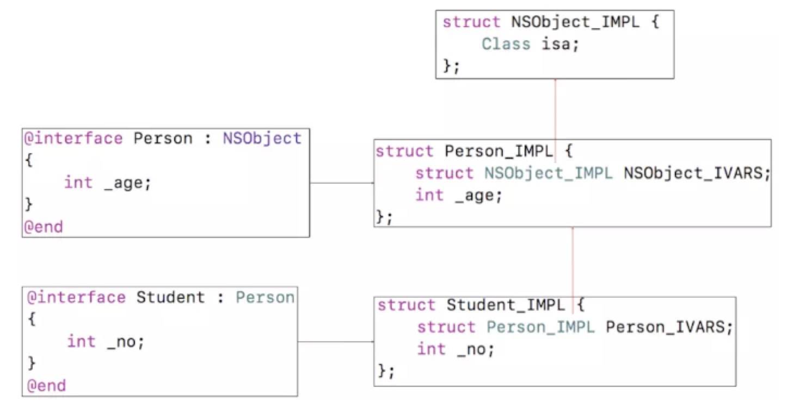
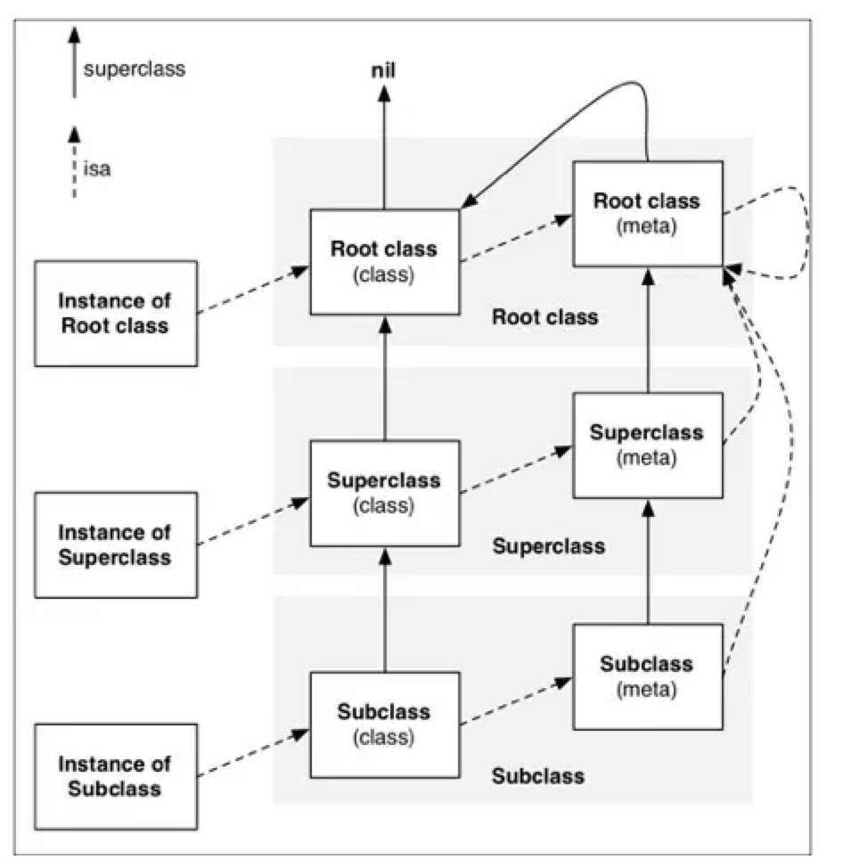

# 探索oc对象的本质

> 一个NSObjec对象占用多少内存

mian.m代码如下

```c
int main(int argc, const char * argv[]) {
    @autoreleasepool {
        NSObject *obj = [[NSObject alloc] init];

    }
    return 0;
}
```

clang后

```c
xcrun -sdk iphoneos clang -arch arm64 -rewrite-objc -fobjc-arc -fobjc-runtime=ios-8.0.0 main.m

```

转化成c++代码

```C
int main(int argc, const char * argv[]) {
    /* @autoreleasepool */ { __AtAutoreleasePool __autoreleasepool; 
        NSObject *obj = ((NSObject *(*)(id, SEL))(void *)objc_msgSend)((id)((NSObject *(*)(id, SEL))(void *)objc_msgSend)((id)objc_getClass("NSObject"), sel_registerName("alloc")), sel_registerName("init"));
    }
    return 0;
}
```

在main.cpp文件中可搜索NSObject_IMPL（IMPL代表implementation实现），内部如下

```c
struct NSObject_IMPL {
	__unsafe_unretained Class isa;
};
//查看Class本质
typedef struct objc_class *Class;
发现Class其实就是一个指针，对象底层发现其实就是这个样子
```

> 一个对象转化成c，发现就是一个结构体有个isa指针。指针在64位架构中占8个字节。也就是说一个NSObjec对象所占用的内存是8个字节。到这里我们已经可以基本解答第一个问题。但是我们发现NSObject对象中还有很多方法，那这些方法不占用内存空间吗？其实类的方法等也占用内存空间，但是这些方法所占用的存储空间并不在NSObject对象中

#### 自定义类的内部实现
代码如下

```c
@interface Student: NSObject {
    @public
    int _no;
    int _age;
}
@end

@implementation Student

@end

int main(int argc, const char * argv[]) {
    @autoreleasepool {
        Student *stu = [[Student alloc] init];
        stu->_no = 4;
        stu->_age = 15;
        NSLog(@"%@",stu);
    }
    return 0;
}

```

clang后主要代码

```C
struct Student_IMPL {
	struct NSObject_IMPL NSObject_IVARS;
	int _no;
	int _age;
};
```
通过上面可知，NSObject_IMPL的结构体中包含了Class isa，
那么可将Student_IMPL转化成下面的代码
```c
struct Student_IMPL {
	Class isa;
	int _no;
	int _age;
};
```

因此，Student结构体占多少存储空间了，isa指针8个 + int类型_no4个 + int类型_age4个 = 16个空间

#### 验证Student在内存中模样
代码如下
```c
struct Student_IMPL {
    Class isa;
    int _no;
    int _age;
};


@interface Student: NSObject {
    @public
    int _no;
    int _age;
}
@end

@implementation Student

@end

int main(int argc, const char * argv[]) {
    @autoreleasepool {
        Student *stu = [[Student alloc] init];
        stu->_no = 4;
        stu->_age = 15;
        NSLog(@"%@",stu);
        
        struct Student_IMPL *stuImpl = (__bridge struct Student_IMPL *)stu;
        NSLog(@"_no = %d, _age = %d", stuImpl->_no, stuImpl->_age); // 打印出 _no = 4, _age = 15

    }
    return 0;
}

```
由此说明stu这个对象指向的内存确实是一个结构体

#### 更复杂的继承关系
代码如下
```C
/* Person */
@interface Person : NSObject
{
    int _age;
}
@end

@implementation Person
@end

/* Student */
@interface Student : Person
{
    int _no;
}
@end

@implementation Student
@end

int main(int argc, const char * argv[]) {
    @autoreleasepool {
        
        NSLog(@"%zd  %zd",
              class_getInstanceSize([Person class]),
              class_getInstanceSize([Student class])
              );
    }
    return 0;
}
```

> 上述Person和Student对象分别占用多少内存？



答： 16 16
只要是继承NSObject对象，那么底层一个有一个isa指针。
其实实际上计算，Person对象只使用了12个字节，但是因为内存对其的原因，是person对象也占用了16个字节。
Student对象包含一个isa指针8个字节，一个int类型_no4个字节，一个int类型_age4个字节。共16个字节

### OC对象的分类
示例代码
```c
@interface Person : NSObject <NSCopying>
{
@public
    int _age;
}
@property (nonatomic, assign) int height;
- (void)personMethod;
+ (void)personClassMethod;
@end

@implementation Person
- (void)personMethod {}
+ (void)personClassMethod {}
@end

/* Student */
@interface Student : Person <NSCoding>
{
@public
    int _no;
}
@property (nonatomic, assign) int score;
- (void)studentMethod;
+ (void)studentClassMethod;
@end

@implementation Student
- (void)studentMethod {}
+ (void)studentClassMethod {}
@end

int main(int argc, const char * argv[]) {
    @autoreleasepool {
        NSObject *object1 = [[NSObject alloc] init];
        NSObject *object2 = [[NSObject alloc] init];
        
        Student *stu = [[Student alloc] init];
        [Student load];
        
        Person *p1 = [[Person alloc] init];
        p1->_age = 10;
        [p1 personMethod];
        [Person personClassMethod];
        Person *p2 = [[Person alloc] init];
        p2->_age = 20;
    }
    return 0;
}

```

#### (1).OC的类信息存放在哪里
oc对象主要可以分为三种
- instance对象 (实例对象)
- class对象（类对象）
- meta-class对象（元类对象）

instance对象在内存中存储的信息包括
1.isa指针
2.其他成员变量

class对象
```C
 Class objectClass1 = [object1 class];
        Class objectClass2 = [object2 class];
        Class objectClass3 = [NSObject class];
        
        // runtime
        Class objectClass4 = object_getClass(object1);
        Class objectClass5 = object_getClass(object2);
        NSLog(@"%p %p %p %p %p", objectClass1, objectClass2, objectClass3, objectClass4, objectClass5);
```
每一个类在内存中有且只有一个class对象，上述打印地址都相同
每个类对象中包含的属性有:
```C
struct _class_t {
	struct _class_t *isa;  // isa指针
	struct _class_t *superclass; //父类
	void *cache; //缓存
	void *vtable; //表
	struct _class_ro_t *ro; 
};

struct _class_ro_t {
	unsigned int flags; //标志
	unsigned int instanceStart; 
	unsigned int instanceSize; // 实例对象size
	const unsigned char *ivarLayout;
	const char *name; //类名
	const struct _method_list_t *baseMethods; //实例方法
	const struct _objc_protocol_list *baseProtocols; // 协议
	const struct _ivar_list_t *ivars; //成员变量
	const unsigned char *weakIvarLayout; //weak引用指针
	const struct _prop_list_t *properties; //属性
};

```
成员变量的值时存储在实例对象中的，因为只有当我们创建实例对象的时候才为成员变赋值。但是成员变量叫什么名字，是什么类型，只需要有一份就可以了。所以存储在class对象中。

##### （2）元类对象 meta-class
类方法放在哪里？
```C
    //runtime中传入类对象此时得到的就是元类对象
        Class objectMetaClass = object_getClass([NSObject class]);
        // 而调用类对象的class方法时得到还是类对象，无论调用多少次都是类对象
        Class cls = [[NSObject class] class];
        Class objectClass3 = [NSObject class];
        NSLog(@"%d",class_isMetaClass(objectMetaClass)); // 1
         // 判断该对象是否为元类对象
        NSLog(@"%p %p %p", objectMetaClass, objectClass3, cls); // 后面两个地址相同，说明多次调用class得到的还是类对象
```
每个类在内存中有且只有一个meta-class对象。
metaClass对象的结构和类对象的是一样的。不同的是，metaClass对象只存储类方法，isa指针，superclass指针等信息
```C
extern "C" __declspec(dllexport) struct _class_t OBJC_METACLASS_$_Student __attribute__ ((used, section ("__DATA,__objc_data"))) = {
	0, // &OBJC_METACLASS_$_NSObject,
	0, // &OBJC_METACLASS_$_Person,
	0, // (void *)&_objc_empty_cache,
	0, // unused, was (void *)&_objc_empty_vtable,
	&_OBJC_METACLASS_RO_$_Student,  //保存类方法
};

```
最后进行关联
```C
static void OBJC_CLASS_SETUP_$_Student(void ) {
	OBJC_METACLASS_$_Student.isa = &OBJC_METACLASS_$_NSObject; //studentd的元类中isa指针指向NSObject元类
	OBJC_METACLASS_$_Student.superclass = &OBJC_METACLASS_$_Person; //student的元类中superclass指向person元类
	OBJC_METACLASS_$_Student.cache = &_objc_empty_cache; //初始化空缓存
	OBJC_CLASS_$_Student.isa = &OBJC_METACLASS_$_Student; //student类的isa指针指向student元类
	OBJC_CLASS_$_Student.superclass = &OBJC_CLASS_$_Person; //student类的superclass指向person
	OBJC_CLASS_$_Student.cache = &_objc_empty_cache; //student的cache初始化为空
}
```
最后上一张isa经典图


对isa、superclass总结
> 1.instance的isa指向class
> 2.class的isa指向meta-class
> 3.meta-class的isa指向基类的meta-class，基类的isa指向自己
> 4.class的superclass指向父类的class，如果没有父类，superclass指针为nil
> 5.meta-class的superclass指向父类的meta-class，基类的meta-class
> 6.superclass指向基类的class
> 7.instance调用对象方法的轨迹，isa找到class，方法不存在，就通过superclass找父类
> 8.class调用类方法的轨迹，isa找meta-class，方法不存在，就通过superclass找父类

