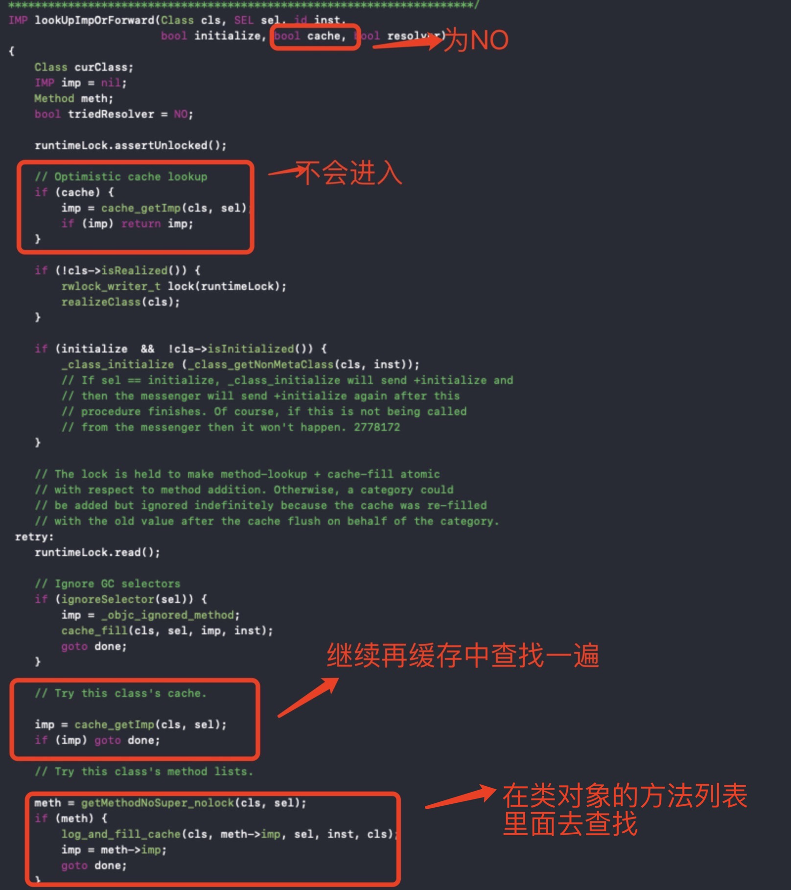
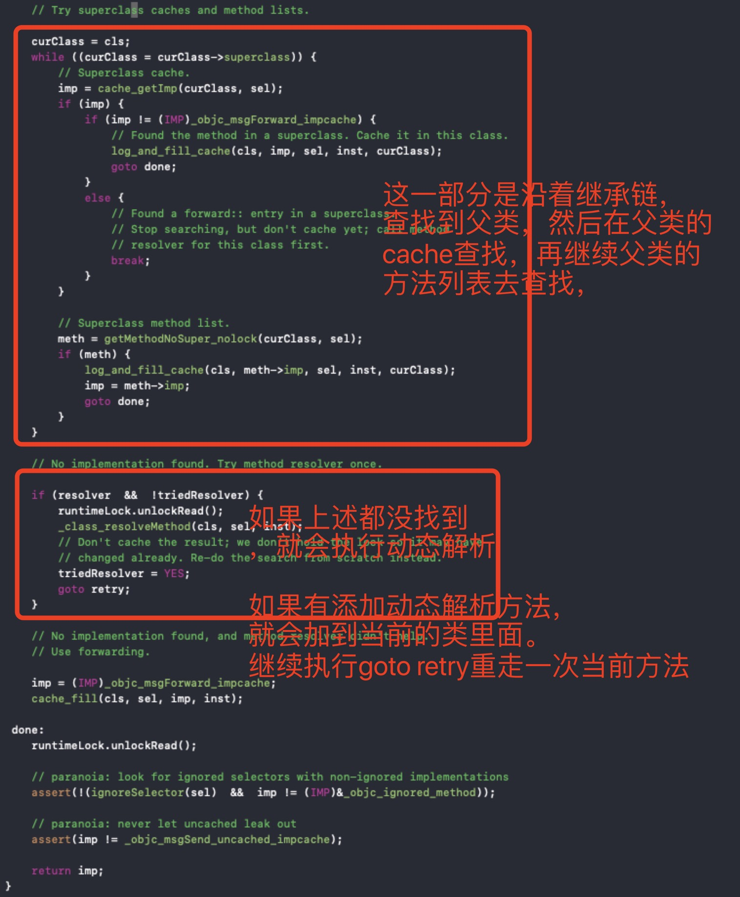

# objc_msgSend()消息机制完全解析
oc调用的方法很清楚，如下：

```c
 [p run];
```

我们通过clang后，得到的c++源码：

```C
((void (*)(id, SEL))(void *)objc_msgSend)((id)p, sel_registerName("run"));
```

简化后：

```C
objc_msgSend(p, sel_registerName("run"))
```

p: 发送消息的对象
sel_registerName: 此方法就是传入方法名，返回SEL，等价于@selector(run)。

**objc_msgSend()的执行流程可以分为三个阶段**
- 消息发送
- 动态方法解析
- 消息转发

下面我们通过runtime源码来了解objc_msgSend的整个过程，看看它究竟是怎么实现的，在底层都做了哪些事情。此方法的实现在objc-msg-arm64.s文件中。有后缀.s结尾的，这是一个汇编语言，基于为什么会使用汇编去实现，我们可知，汇编是最接近机器的语言，在速度性能方面都是最优的方案，当然还有更多其他的方面，作者也不太清楚过多的东西。

#### 消息发送
在objc-msg-arm64.s文件中，找到_objc_msgSend相关的汇编代码

```c
ENTRY _objc_msgSend
	MESSENGER_START  
    // x0寄存代表消息接受者
	cmp	x0, #0			// x0是_objc_msgSend第一个参数代表接受消息的对象
	b.le	LNilOrTagged		//  b：跳转，le：小于等于， 也就是说x0小于等于 #0时, 跳转到LNilOrTagged,
	ldr	x13, [x0]		// x13 = isa
	and	x9, x13, #ISA_MASK	// x9 = class	
LGetIsaDone:
	CacheLookup NORMAL		// calls imp or objc_msgSend_uncached

LNilOrTagged:
	b.eq	LReturnZero		// 如果消息接受者为空，直接退出这个函数

	// tagged
	adrp	x10, _objc_debug_taggedpointer_classes@PAGE
	add	x10, x10, _objc_debug_taggedpointer_classes@PAGEOFF
	ubfx	x11, x0, #60, #4
	ldr	x9, [x10, x11, LSL #3]
	b	LGetIsaDone

LReturnZero:
	// x0 is already zero
	mov	x1, #0
	movi	d0, #0
	movi	d1, #0
	movi	d2, #0
	movi	d3, #0
	MESSENGER_END_NIL
	ret

	END_ENTRY _objc_msgSend

```

我们一行一行的分析
* 1. **cmp 	x0, #0**这里x0代表寄存器，#0代表objc_msgSend传进来的第一个参数，这里就是讲第一个参数传入到x0寄存器当中，第一个参数就是消息的接受者
* 2. **b.le	 LNilOrTagged**，b：跳转，le：小于等于， 也就是说x0小于等于 #0时, 跳转到LNilOrTagged.

    ```C
    LNilOrTagged:
	       b.eq	 LReturnZero
    ```
    
    **b.eq 	LReturnZero**,  如果消息接受者为空，直接退出这个函数,就不做任何操作
    
* 3. **CacheLookup NORMAL**，中间省略了几行不是重点代码，直接调转到这行，CacheLookup看字面意思就是查找缓存。在当前.s文件全局搜索，会找到代码如下：

```s
    .macro CacheLookup   //可以看出这是一个定义
	// x1 = SEL, x9 = isa
	ldp	x10, x11, [x9, #CACHE]	// x10 = buckets, x11 = occupied|mask
	and	w12, w1, w11		// x12 = _cmd & mask
	add	x12, x10, x12, LSL #4	// x12 = buckets + ((_cmd & mask)<<4)

	ldp	x16, x17, [x12]		// {x16, x17} = *bucket
1:	cmp	x16, x1			// if (bucket->sel != _cmd)
	b.ne	2f			//     scan more
	CacheHit $0			// call or return imp
	
2:	// not hit: x12 = not-hit bucket
	CheckMiss $0			// miss if bucket->cls == 0
	cmp	x12, x10		// wrap if bucket == buckets  x12代表索引，去cache中查找
	b.eq	3f
	ldp	x16, x17, [x12, #-16]!	// {x16, x17} = *--bucket
	b	1b			// loop

3:	// wrap: x12 = first bucket, w11 = mask
	add	x12, x12, w11, UXTW #4	// x12 = buckets+(mask<<4)

	// Clone scanning loop to miss instead of hang when cache is corrupt.
	// The slow path may detect any corruption and halt later.

	ldp	x16, x17, [x12]		// {x16, x17} = *bucket
1:	cmp	x16, x1			// if (bucket->sel != _cmd)
	b.ne	2f			//     scan more
	CacheHit $0			// call or return imp
	
2:	// not hit: x12 = not-hit bucket
	CheckMiss $0			// miss if bucket->cls == 0
	cmp	x12, x10		// wrap if bucket == buckets
	b.eq	3f
	ldp	x16, x17, [x12, #-16]!	// {x16, x17} = *--bucket
	b	1b			// loop

3:	// double wrap
	JumpMiss $0
	
.endmacro

```

* 3.如果在缓存中找到了方法那就直接调用，**CacheHit $0**，那接下去就看从缓存中没有找到方法会做什么，	**CheckMiss $0**，字面上看就是没有查找到，我们继续在当前文件搜索CheckMiss，发现代码如下：

```s
.macro CheckMiss  //是个宏定义
.if $0 == NORMAL			// miss if bucket->cls == 0 会进入此条件
	cbz	x16, __objc_msgSend_uncached_impcache //如果在缓存中没有找到，就会执行这个函数
.else
	cbz	x16, LGetImpMiss
.endif
.endmacro

```

* 4. 继续搜索**__objc_msgSend_uncached_impcache**，会找到如下的代码入口

```S

	STATIC_ENTRY __objc_msgSend_uncached_impcache

	// THIS IS NOT A CALLABLE C FUNCTION
	// Out-of-band x9 is the class to search

	MESSENGER_START
	
	// push frame
	stp	fp, lr, [sp, #-16]!
	mov	fp, sp

	MESSENGER_END_SLOW

	// save parameter registers: x0..x8, q0..q7
	sub	sp, sp, #(10*8 + 8*16)
	stp	q0, q1, [sp, #(0*16)]
	stp	q2, q3, [sp, #(2*16)]
	stp	q4, q5, [sp, #(4*16)]
	stp	q6, q7, [sp, #(6*16)]
	stp	x0, x1, [sp, #(8*16+0*8)]
	stp	x2, x3, [sp, #(8*16+2*8)]
	stp	x4, x5, [sp, #(8*16+4*8)]
	stp	x6, x7, [sp, #(8*16+6*8)]
	str	x8,     [sp, #(8*16+8*8)]

	// receiver and selector already in x0 and x1
	mov	x2, x9
	bl	__class_lookupMethodAndLoadCache3

	// imp in x0
	mov	x17, x0
	
	// restore registers and return
	ldp	q0, q1, [sp, #(0*16)]
	ldp	q2, q3, [sp, #(2*16)]
	ldp	q4, q5, [sp, #(4*16)]
	ldp	q6, q7, [sp, #(6*16)]
	ldp	x0, x1, [sp, #(8*16+0*8)]
	ldp	x2, x3, [sp, #(8*16+2*8)]
	ldp	x4, x5, [sp, #(8*16+4*8)]
	ldp	x6, x7, [sp, #(8*16+6*8)]
	ldr	x8,     [sp, #(8*16+8*8)]

	mov	sp, fp
	ldp	fp, lr, [sp], #16
	
	br	x17

	END_ENTRY __objc_msgSend_uncached_impcache

```

我们直接略过其他的汇编代码，在中间发现了这样一句代码，**bl	__class_lookupMethodAndLoadCache3**，我们的本能告诉我们，又是一个宏定义跳转，我们就在当前文件搜索__class_lookupMethodAndLoadCache3，但是并没有找到。
那么当前文件没有找到，就在整个开源的runtime代码里面查找，我们发现搜索出来的全是汇编里面的调用，没有找到我们想要的信息。
接下来实在没办法，我们接方法的下划线去掉搜索。

* 5. 在**objc-runtime-new.mm**中找到了。

```c
IMP _class_lookupMethodAndLoadCache3(id obj, SEL sel, Class cls)
{
    return lookUpImpOrForward(cls, sel, obj, 
                              YES/*initialize*/, NO/*cache*/, YES/*resolver*/);
}

```

继续lookUpImpOrForward方法探索之旅



> 发送消息总结：
> 1. 先判断接收者是不是nil
> 2. 先从接收者对象的cache中查找
> 3. 从接收者类对象中的class_rw_t中的method_list中查找
> 4. 沿着继承链，会重复123步操作。
> 5. 接下来，会执行动态解析。
> 6. 继续消息转发
> 7. 崩溃

上述步骤都是没有找到此方法后的一个流程，若在其中一个步骤中找到了方法，都会结束当前操作。

#### 动态方法解析

在上述的代码中继续回到动态解析代码：
```C

    // No implementation found. Try method resolver once.

    if (resolver  &&  !triedResolver) {
        runtimeLock.unlockRead();
        _class_resolveMethod(cls, sel, inst);
        // Don't cache the result; we don't hold the lock so it may have 
        // changed already. Re-do the search from scratch instead.
        triedResolver = YES;
        goto retry;
    }

```

接续回到

```c
void _class_resolveMethod(Class cls, SEL sel, id inst)
{
    // 判断是不是元类
    if (! cls->isMetaClass()) {
        // try [cls resolveInstanceMethod:sel]
        //如果不是元类，就是类对象，就调用实例动态解析方法
        _class_resolveInstanceMethod(cls, sel, inst);
    } 
    else {
        // try [nonMetaClass resolveClassMethod:sel]
        // and [cls resolveInstanceMethod:sel]
        // 是元类，就调用类的动态解析方法
        _class_resolveClassMethod(cls, sel, inst);
        if (!lookUpImpOrNil(cls, sel, inst, 
                            NO/*initialize*/, YES/*cache*/, NO/*resolver*/)) 
        {
            _class_resolveInstanceMethod(cls, sel, inst);
        }
    }
}
```


#### 消息转发
继续回到上面代码，查看消息转发的部分代码：

```c
  // No implementation found, and method resolver didn't help. 
    // Use forwarding.

    imp = (IMP)_objc_msgForward_impcache;
    cache_fill(cls, sel, imp, inst);
```

**_objc_msgForward_impcache**继续回到汇编语言中

```s
STATIC_ENTRY __objc_msgForward_impcache

	MESSENGER_START
	nop
	MESSENGER_END_SLOW

	// No stret specialization.
	b	__objc_msgForward

	END_ENTRY __objc_msgForward_impcache

```

继续探索**__objc_msgForward**：

```s
	ENTRY __objc_msgForward

	adrp	x17, __objc_forward_handler@PAGE
	ldr	x17, [x17, __objc_forward_handler@PAGEOFF]
	br	x17
	
	END_ENTRY __objc_msgForward
```

**__objc_forward_handler**怎么也没搜索到，应该是没开源出来。

> 总结：
> 动态解析，和消息转发就是实现三个方法，这里不做更多详细的介绍，后续会有篇幅继续介绍
